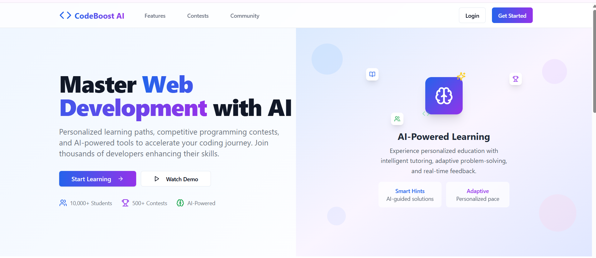

<p align="center">
  
</p>

<h1 align="center">🧠 Code Boost AI Learn</h1>

<p align="center">
  <em>A beginner-friendly AI-powered interactive coding and learning platform.</em>
</p>

---

## 🚀 What You Will Learn

<p align="center">
  
  
  
  
  
</p>

---
## 📚 Overview

**Code Boost AI Learn** is a smart coding repository designed to enhance your programming skills through AI-assisted learning. Whether you're a beginner or an enthusiast exploring new technologies, this repo offers a curated learning experience with interactive code, AI guidance, and hands-on tasks.

---
## 📸 Website Preview



---

## 🛠️ Features

- ✅ Beginner-friendly code snippets  
- 🤖 AI-assisted learning concepts  
- 📂 Organized by topics  
- 🧪 Real-life project-based learning  
- 📌 Easy to contribute and extend  

---

## 🧾 Topics Covered

| 🚀 Topics        | 💬 Description                                 |
|------------------|-----------------------------------------------|
| Python Basics     | Variables, Loops, Functions, and more         |
| OOP in Python     | Classes, Objects, Inheritance, Encapsulation |
| AI Concepts       | ML basics, Algorithms, and applications       |
| Data Structures   | Lists, Stacks, Queues, Trees, Graphs          |
| Problem Solving   | LeetCode-style DSA tasks                      |

---

## 📁 Project Structure

```
code-boost-ai-learn/
├── python_basics/
├── oop/
├── ai_concepts/
├── data_structures/
├── projects/
└── README.md
```

---

## 🚀 Getting Started

1. Clone the repo:
   ```bash
   git clone https://github.com/mahiamOmO/code-boost-ai-learn.git
   ```

2. Navigate to the folder:
   ```bash
   cd code-boost-ai-learn
   ```

3. Start exploring the files and practice coding!

---

## 🧠 Learn by Doing

You’ll find:
- 📘 Step-by-step guides  
- 🔍 Explanations with examples  
- 💡 AI-generated hints & best practices  
- 📝 Tasks to try on your own  

---

## 🤝 Contributing

We welcome contributions! Here's how you can help:

- Fork the repository  
- Create your branch (`git checkout -b feature-xyz`)  
- Commit your changes (`git commit -m 'Added new topic'`)  
- Push to the branch (`git push origin feature-xyz`)  
- Create a pull request  

---

## ✨ Credits

Maintained by [@mahiamOmO](https://github.com/mahiamOmO).  
Follow me on [LinkedIn](https://linkedin.com/in/mahiamomo12/) | [Dev.to](https://dev.to/mahiamomo) | [Medium](https://medium.com/@mahiamomo)

---

## 🌟 Show Your Support

If you found this helpful, please ⭐ the repo and share it with others!

---

<p align="center">
  <strong>Happy Coding! 🚀</strong>
</p>
